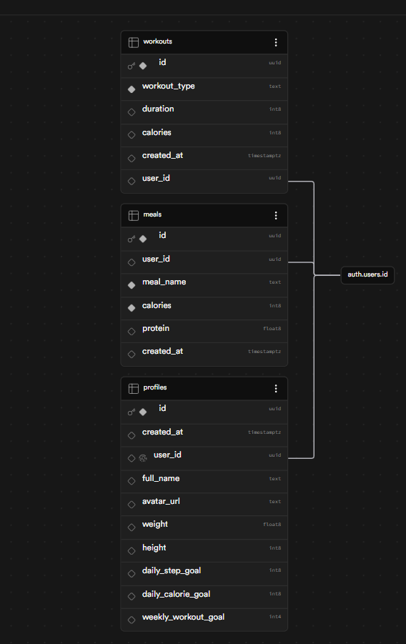

# פרויקט גמר - אפליקציית HOBIT

## 1. קישור לפרויקט עובד (Deployed on Vercel)
**קישור לאתר החי באוויר:** [https://hobit-eta.vercel.app](https://hobit-eta.vercel.app)

---

## 2. סקירה כללית וריפו GitHub

### סקירה כללית
אפליקציית HOBIT היא מערכת מודרנית ואינטראקטיבית המשלבת בין שני עולמות מרכזיים בחיי היומיום: ניהול הרגלים בריאים (Habits) ופיתוח פנאי ותחביבים (Hobbies). המערכת מספקת למשתמשים פלטפורמה אחת מרכזית שבה הם יכולים לעקוב אחר תזונה, צריכת מים, כמות צעדים יומית וביצוע אימונים, תוך קבלת משוב ויזואלי מיידי על קצב ההתקדמות שלהם.

### הבעיה שהפרויקט פותר (הכאב הקונקרטי)
בעידן המודרני, אנשים רבים מציבים לעצמם מטרות לניהול אורח חיים בריא אך מתקשים להתמיד בהן לאורך זמן. הבעיה המרכזית היא חוסר בריכוז הנתונים וחוסר בתגמול ויזואלי מיידי. כאשר המעקב אחר תזונה מתבצע באפליקציה אחת, מעקב הצעדים בשעון, ויומן המשימות הכללי במחברת, נוצר פיזור שגורם לנטישה מהירה. HOBIT פותרת את הכאב הזה על ידי איחוד כל המדדים החיוניים תחת קורת גג אחת ומספקת למשתמש תמונת מצב ויזואלית אינטואיטיבית שמניעה אותו להמשך.

### קהל היעד
קהל היעד של המערכת מורכב מאנשים המעוניינים לשפר או לשמור על אורח חיים בריא, חובבי כושר וספורט, וכן משתמשים המתקשים ביצירת שגרה קבועה וזקוקים לכלי ויזואלי פשוט ונקי שיעזור להם לעקוב אחר המטרות שלהם בצורה יומיומית.

### מתחרים ובידול המוצר
בשוק קיימות אפליקציות רבות למעקב תזונה או מעקב הרגלים, אך רובן סובלות מעומס נתונים או ממשקים מורכבים מדי. 
מה שמייחד את HOBIT והופך אותה לפנומנלית הוא השילוב הייחודי והקשר הלוגי הדינמי בין חלקי המערכת:
1. **מד דלק אינטראקטיבי:** האפליקציה מציגה סוללת הרגלים מרכזית המשקפת את רמת ההתמדה השבועית של המשתמש.
2. **ניהול שבועי בלייב:** המשתמש יכול לעדכן ולסמן בלחיצת כפתור את ימי השבוע שעברו, וכל שינוי משפיע באופן ישיר ובזמן אמת על מצב הסוללה ומדדי הרצף (Streak).
3. **חווית משתמש נקייה:** עיצוב מינימליסטי וממוקד המונע הצפה של המשתמש ומאפשר לו להבין את מצבו בשנייה אחת של מבט על המסך.

### נתוני גישה למערכת במצב מצגת (נתוני דמו לבדיקה)
* **אימייל לבדיקה:** `demo@hobit.com`
* **סיסמה לבדיקה:** `123456`
*(ניתן ללחוץ ישירות על כפתור התחבר במסך הראשי כדי להיכנס למערכת).*

---

## 3. תרשים ERD — מודל הנתונים (Supabase)
להלן תרשים הישויות-קשרים (ERD) המציג את מבנה הטבלאות, העמודות, הטיפוסים, המפתחות הראשיים והזרים (Primary / Foreign Keys) והקשרים ביניהן כפי שהופק מתוך ה-Schema Visualizer ב-Supabase:


 תרשים ERD — מודל הנתונים (Supabase)

להלן מודל ישויות-קשרים (ERD) המציג את ארכיטקטורת מסד הנתונים, סוגי הנתונים והקשרים הלוגיים בין הישויות במערכת:

```mermaid
erDiagram
    auth_users {
        uuid id PK
        string email
    }

    profiles {
        uuid id PK
        uuid user_id FK
        string full_name
        string avatar_url
        float weight
        int height
        int daily_step_goal
        int daily_calorie_goal
        timestamp created_at
    }

    meals {
        uuid id PK
        uuid user_id FK
        string meal_name
        int calories
        float protein
        timestamp created_at
    }

    workouts {
        uuid id PK
        uuid user_id FK
        string workout_type
        int duration
        int calories
        timestamp created_at
    }

    auth_users ||--|| profiles : "has_one"
    auth_users ||--o{ meals : "logs_many"
    auth_users ||--o{ workouts : "tracks_many"

---

## 4. רשימת שירותים חיצוניים ואינטגרציות

| שירות | סוג | למה משמש |
| :--- | :--- | :--- |
| **Supabase Database** | מסד נתונים בענן | אחסון מבוזר של נתוני פרופיל המשתמש, יומן הארוחות והאימונים בזמן אמת. |
| **Supabase Auth** | אוטנטיקציה | תשתית מובנית לרישום, התחברות וניהול סשן מאובטח של משתמשי האפליקציה. |
| **Stripe Payments** | קריאת API / תשלומי | ניהול ושדרוג משתמשים למסלול פרימיום (Upgrade) דרך רכיב מאובטח לפתיחת פיצ'רים מתקדמים. |
| **Vercel Hosting** | פלטפורמת אחסון ופריסה | הרצת האתר החי, ניהול הדומיין המותאם, וביצוע עדכונים אוטומטיים ישירות ממאגר הקוד. |
| **Google Material Symbols** | ספריית רכיבים ויזואליים | אספקת האייקונים הדינמיים של הממשק כדוגמת סימני הביצוע, התפריטים וכפתור הברק המותגי. |